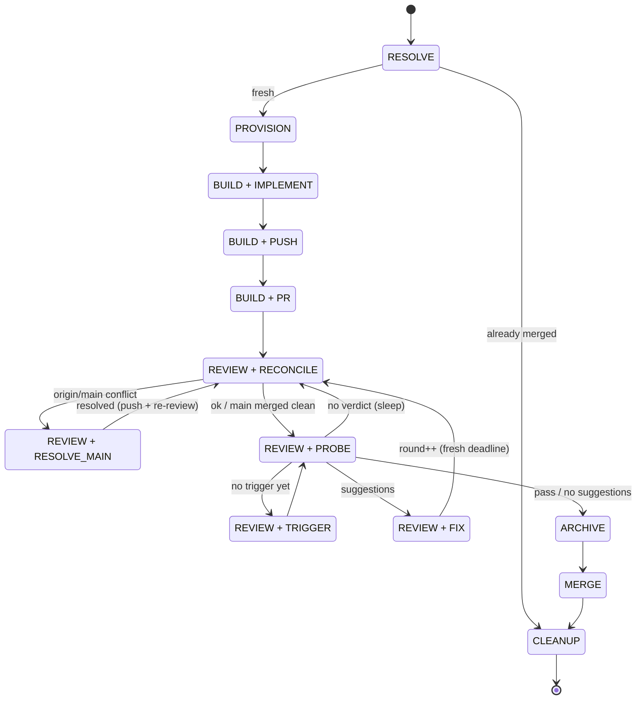

# spec-codex-loop

A [pi](https://pi.dev) extension that runs an **autonomous spec-driven PR loop** on `TODO.md`, gated by OpenAI Codex review. Add an OpenSpec change as a `- [ ] <change>` line in `TODO.md`; `/loop` spins up a worktree, implements it, opens a PR, drives Codex review to a pass, archives, merges, and tears down the worktree.

## States

13 个状态:`BUILD` 和 `REVIEW` 各携带 inner 子状态(各自落盘、可重入)。按流转顺序排列。

| # | 状态 | 中文名 | 说明 |
|---|------|--------|------|
| 1 | RESOLVE | 解析 | 探测上次运行状态,决定入口(按 reality 现场推导) |
| 2 | PROVISION | 预置 | 建 worktree + 环境文件 + openspec(按 reality 现场推导) |
| 3 | BUILD + IMPLEMENT | 实现 | agent: openspec-apply-change + 测试 + commit |
| 4 | BUILD + PUSH | 推送 | git push -u origin <change>(幂等)|
| 5 | BUILD + PR | 开 PR | gh pr create → 进入 REVIEW(已存在则跳过)|
| 6 | REVIEW + RECONCILE | 协调 | fetch + 对齐 local/origin HEAD;睡眠/唤醒的恢复入口;origin/main 前进时检测(干净自动合 / 冲突转 #7)|
| 7 | REVIEW + RESOLVE_MAIN | 解冲突 | origin/main 与本 change 冲突时,agent 带 openspec 上下文解冲突,commit |
| 8 | REVIEW + PROBE | 探测 | 读一次 Codex verdict,纯查询无副作用 |
| 9 | REVIEW + TRIGGER | 触发 | 发 @codex review,记 triggerAt + 截止时间 |
| 10 | REVIEW + FIX | 修复 | agent 跑一轮,round++,**重置 review 截止时间**(给新 head 新鲜窗口,不继承触发时的 deadline)|
| 11 | ARCHIVE | 归档 | openspec archive + 标记 TODO [x] → 提交 → 推送 |
| 12 | MERGE | 合并 | gh pr merge --squash --delete-branch |
| 13 | CLEANUP | 清理 | 删 worktree + sync main(终态)|

`.loop-state.json`(`.worktree/<change>/`)落盘:#3–13 都作为重入点持久化;#1–2 不写盘,崩了靠 `resolvePhase(reality)` 现场重推(worktree/PR/archived 状态)。CLEANUP 写一次后,合并完成即 `clearLoopState` 删文件。

任意 REVIEW 状态 stop(timeout / quota / codex_error / diverged / push 失败)都清 `triggerAt`+`reviewDeadline` 并留 PR+worktree,所以 `/loop resume` 会重触发 `@codex review`,不在陈旧触发上死循环。

状态流转:



## Install

Copy into pi's global extensions dir (auto-discovered, hot-reloads with `/reload`):

```bash
mkdir -p ~/.pi/agent/extensions
cp dev-loop.ts ~/.pi/agent/extensions/dev-loop.ts
```

Or load once for testing without installing:

```bash
pi -e ./dev-loop.ts
```

Then `/reload` inside pi (or restart) to pick it up.

## Usage

```
/loop init             First-time setup: create TODO.md, git-ignore TODO.md + .worktree/, openspec init
/loop                  Run the next TODO change end-to-end, then stop
/loop <change>         Run a specific change (added to TODO.md if absent, then run)
/loop --dry-run        Build phase only; skip push / PR / review / archive / merge
/loop --all            Keep pulling changes until TODO.md has none left

/loop stop             Stop the running loop at the next safe boundary (PR + worktree kept)
/loop fetch            Re-fetch the Codex review now instead of waiting ≤10min
/loop resume           Resume the change last stopped via /loop stop (re-triggers @codex review on quota / bot error)
/loop status           Show every persisted state: phase/inner, round, PR, stop reason
```

### First-time setup

`/loop init` (idempotent) creates `TODO.md` (tracked — its `- [x]` flips ride each PR), adds `.worktree/` to local gitignore, and runs `openspec init --tools pi`.

### `TODO.md` format

One OpenSpec change name per checkbox line at the repo root (case-insensitive filename):

```markdown
- [ ] add-user-auth
- [ ] fix-macos-login-chain
```

Each must exist under `openspec/changes/`. On merge the line flips to `- [x]`.

### Why a separate `TODO.md`

OpenSpec knows what's done (`archive`), but change names can't carry ordering — `validateChangeName` requires a leading lowercase letter, and `openspec list` only sorts by recent/name. `TODO.md` is the sequencing layer (line order); the change name stays a clean identifier (the "what").

## License

MIT
