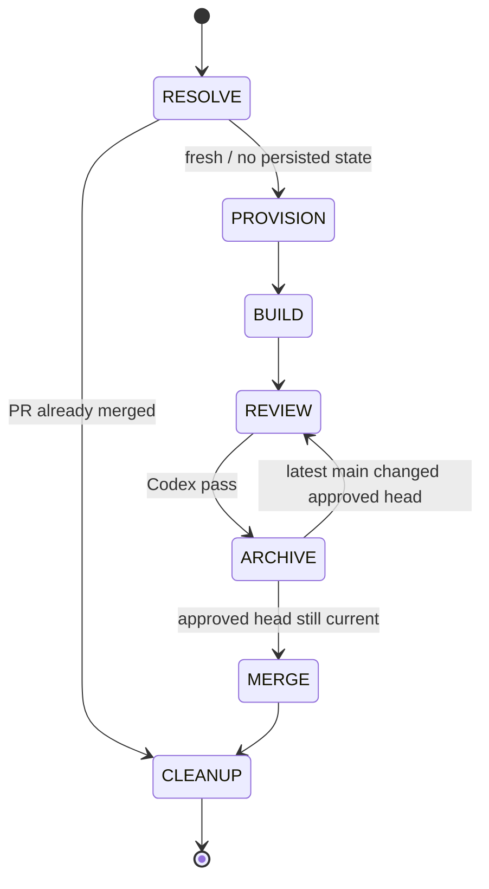

# spec-codex-loop

`spec-codex-loop` 是一个 [Pi](https://pi.dev) extension：它按 `TODO.md` 顺序处理 OpenSpec change，在独立 Git worktree 中驱动 agent 实现、测试和提交，创建 PR，通过 Codex review 门禁后归档 OpenSpec、合并 PR，并清理现场。

整个流程可持久化、可停止、可跨进程恢复。LLM 429、Git/GitHub 瞬时失败、Pi 或宿主进程异常退出都不会要求从头开始。

## Requirements

- Node.js 26+（使用原生 `Temporal` 和 `node:sqlite`）
- Pi coding agent
- `git`，仓库默认分支为 `main`，远端名为 `origin`
- 已登录的 GitHub CLI：`gh auth status`
- OpenSpec CLI：`openspec`
- PR 所在仓库已启用可响应 `@codex review` 的 Codex review 集成

运行 `/loop` 前，目标 OpenSpec change 必须存在于 `openspec/changes/<change>/`，并已提交、推送到 `origin/main`。这是新 worktree 能继承 proposal/tasks/specs 的前提。

## Install

作为 Pi package 全局安装：

```bash
pi install git:github.com/1yx/spec-codex-loop
```

仅为当前项目安装：

```bash
pi install git:github.com/1yx/spec-codex-loop -l
```

从本地 checkout 安装或直接测试：

```bash
pi install /absolute/path/to/spec-codex-loop

# 不写入 Pi settings，仅加载本次会话
pi -e /absolute/path/to/spec-codex-loop/src/dev-loop.ts
```

安装后重启 Pi；已运行的 Pi 会话可使用 `/reload`。

## Quick Start

在目标 Git 仓库中执行：

```text
/loop init
```

`/loop init` 是幂等操作，会：

1. 创建 `TODO.md`（若不存在）。
2. 执行 `openspec init --tools pi`（若 `openspec/` 不存在）。
3. 将 `TODO.md` 和 `openspec/` 加入 Git。
4. 创建 `chore: initialize spec-codex-loop` commit，并推送到 `origin/main`。
5. 在 `.git/info/exclude` 中忽略 `.worktree/` 和 `.dev-loop.lock*` 等本地运行文件。

然后创建 OpenSpec change，在 `TODO.md` 中按期望顺序加入 checkbox，并提交、推送到 `main`：

```markdown
- [ ] add-user-auth
- [ ] fix-macos-login-chain
```

最后运行：

```text
/loop
```

## Commands

| 命令 | 行为 |
|---|---|
| `/loop init` | 初始化并跟踪 `TODO.md` 与 `openspec/`；有新文件时自动 commit/push |
| `/loop` | 执行 `TODO.md` 中第一个未勾选 change，成功合并后标记为 `[x]` |
| `/loop <change>` | 执行指定的现有 OpenSpec change；这是 one-off 运行，不新增或修改 TODO 条目 |
| `/loop --all` | 每个 change 合并后继续处理下一个未勾选 TODO，直到没有任务 |
| `/loop --dry-run` | 只在 worktree 中运行实现阶段；不 push、不创建 PR，保留 worktree |
| `/loop stop` | 请求在下一个安全边界停止，保留 PR、worktree 和持久化状态 |
| `/loop fetch` | 立即唤醒等待中的 REVIEW 并重新读取 Codex verdict |
| `/loop resume` | 恢复唯一的 stopped/crashed 持久化状态；存在多个候选时拒绝猜测 |
| `/loop status` | 列出全部持久化 change 的 phase、inner、round、PR 和 stop reason |

等待 REVIEW 时也可从其他终端使用文件信号：

```bash
touch .dev-loop-fetch
touch .dev-loop-stop
```

`stop` 与 `fetch` 同时出现时，`stop` 优先并消费两个信号。loop 活跃期间，Pi 中的普通交互输入会被忽略，控制操作应使用上述命令或 sentinel 文件。

## Lifecycle

共有 7 个 outer phase；`BUILD` 有 3 个 inner state，`REVIEW` 有 5 个 inner state。按可执行重入点展开后共 13 个状态。

| # | 状态 | 作用 |
|---|---|---|
| 1 | `RESOLVE` | 根据 worktree、PR、archive 等现场状态推导恢复入口 |
| 2 | `PROVISION` | fetch `origin/main`，创建/复用 `.worktree/<change>`，复制 `.env*` |
| 3 | `BUILD / IMPLEMENT` | agent 应用 OpenSpec change、运行测试并提交 |
| 4 | `BUILD / PUSH` | `git push -u origin <change>` |
| 5 | `BUILD / PR` | 创建或复用 PR，进入 REVIEW |
| 6 | `REVIEW / RECONCILE` | 同步 change branch，检查并合入最新 `origin/main` |
| 7 | `REVIEW / RESOLVE_MAIN` | agent 结合 OpenSpec 上下文解决 main merge conflict |
| 8 | `REVIEW / PROBE` | 查询当前 head 的 Codex verdict，无外部写副作用 |
| 9 | `REVIEW / TRIGGER` | 先持久化 attempt nonce，再发布 `@codex review` |
| 10 | `REVIEW / FIX` | agent 修复 suggestions，提交并推送新 head，`round++` |
| 11 | `ARCHIVE` | 再次同步 main，通过门禁后 archive、更新 TODO、提交并推送 |
| 12 | `MERGE` | `gh pr merge --squash --delete-branch` |
| 13 | `CLEANUP` | 先 fast-forward 本地 main，再删除 worktree 和本地 change branch |

Outer lifecycle：



BUILD 与 REVIEW inner lifecycle：

```mermaid
stateDiagram-v2
    [*] --> IMPLEMENT: no open PR
    [*] --> RECONCILE: open PR / REVIEW resume
    IMPLEMENT --> PUSH
    PUSH --> PR
    PR --> RECONCILE

    RECONCILE --> PROBE: branch aligned / main merged clean
    RECONCILE --> RESOLVE_MAIN: main conflict
    RESOLVE_MAIN --> RECONCILE: conflict resolved

    PROBE --> TRIGGER: no verdict and no active attempt
    TRIGGER --> PROBE: nonce + triggerAt + deadline persisted
    PROBE --> RECONCILE: no verdict; suspend and wait
    PROBE --> FIX: suggestions
    FIX --> RECONCILE: new head; round++
    PROBE --> ARCHIVE: pass

    ARCHIVE --> PROBE: main changed approved head
    ARCHIVE --> MERGE: head unchanged
    MERGE --> CLEANUP
    CLEANUP --> [*]
```



## Codex Review Gate

- Verdict 按 PR head SHA 归属，不会把旧 head 的 pass/suggestions 用到新 head。
- GitHub issue comments、reviews、inline comments 和 reactions 都会分页读取。
- 一个 trigger attempt 由 `(head, triggerNonce)` 唯一标识。nonce 在发评论前落盘，因此评论成功后进程崩溃也不会重复发布同一次 trigger。
- quota、timeout、Codex error 等已结束的 attempt 会清除 `triggerAt`、`triggerNonce` 和 deadline；`/loop resume` 会为同一 head 创建全新 attempt。
- 默认每 2 分钟 probe 一次，每轮 review 最长等待 30 分钟；`/loop fetch` 可立即 probe。
- Codex pass 后，ARCHIVE 仍会 fetch/merge 最新 main。只要 head 改变，就必须回到 REVIEW，不能归档未经评审的新 head。

## Persistence And Recovery

状态文件位于：

```text
.worktree/<change>/.loop-state.json
```

`BUILD / IMPLEMENT` 到 `CLEANUP` 的 11 个执行状态都会原子落盘。`RESOLVE` 和 `PROVISION` 不依赖状态文件；文件缺失或损坏时，会根据 worktree、PR 和 archive 现场重新推导。

恢复规则：

- LLM 429 或其他 provider error：等待 Pi 自动重试结束，原 inner state 保持不变，`/loop resume` 从同一 agent 阶段继续。
- FIX 中错误前已经产生 commit：持久化的 `agentHead` 用于识别真实进展，不会误报 `no_progress`。
- Git push、PR create、Codex trigger、archive、merge 等副作用：状态在边界前后落盘，并结合远端现实检查实现幂等恢复。
- 未知异常抛出：释放 timer、运行时状态和仓库锁；已有状态继续使用，早期 RESOLVE/PROVISION 则按现场重推，同一 Pi 进程可直接 `/loop resume`。
- Pi/Node 进程退出：SQLite 排他事务由 OS 自动释放；遗留 owner/旧 `.reclaim` 文件在下次获取锁时清理。
- 同一仓库同一时间只允许一个 loop。`.dev-loop.lock.sqlite` 负责跨进程互斥，`.dev-loop.lock` 保存 PID/owner token 用于诊断和旧版本兼容。

`/loop resume` 优先选择带 `stopReason` 的状态；如果没有 stopped state，则允许恢复唯一的 crash state。多个候选存在时不会自动选择。

## Git And TODO Semantics

- TODO 文件名大小写不敏感，但格式必须是 `- [ ] <change>`。
- 普通 `/loop` 和 `/loop --all` 在 ARCHIVE commit 中将对应条目标为 `- [x]`。
- `/loop <change>` 是 one-off，不会增加、勾选或重排 TODO。
- change worktree 从最新 `origin/main` 创建；`openspec/` 必须已经受 Git 跟踪。
- `.env` 和 `.env.*` 会从主 checkout 复制到 worktree，跳过 `.git`、`node_modules` 和 `.worktree`。
- change branch 只允许 fast-forward 对齐；local/remote 已分叉时停止，交给用户明确解决。
- CLEANUP 只以 fast-forward 方式同步本地 main，失败时告警，不进行隐式重写历史。

## Tests

```bash
pnpm install
pnpm test
pnpm typecheck
pnpm lint
```

测试覆盖：

- 全部 11 个持久化重入点和 23 组失败/恢复流程。
- 6 个真实裸远端 Git 场景，包括 fast-forward、divergence、merge conflict 和模糊 push 结果。
- 18 个外部副作用前/后崩溃边界，以及同进程异常抛出恢复。
- GitHub 分页、旧 head 隔离、reaction pass 和 trigger attempt 去重。
- fresh、`--all`、`--dry-run`、one-off、init、status 主流程。
- 损坏/旧版状态、原子写失败、并发 stale-lock 回收、持锁进程 `SIGKILL`。
- stop/fetch 优先级、deadline 边界、stale timer 和 agent settlement 竞态。

## License

MIT
