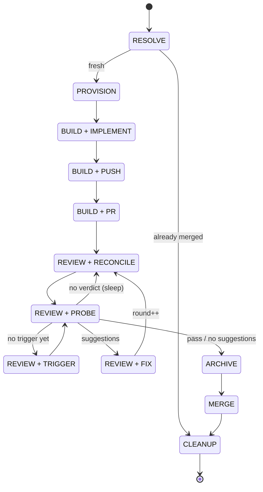

# spec-codex-loop

A [pi](https://pi.dev) extension that runs an **autonomous spec-driven PR loop** on `TODO.md`, gated by OpenAI Codex review. Add an OpenSpec change as a `- [ ] <change>` line in `TODO.md`; `/loop` spins up a worktree, implements it, opens a PR, drives Codex review to a pass, archives, merges, and tears down the worktree.

## States

12 个状态:`BUILD` 和 `REVIEW` 各携带 inner 子状态(各自落盘、可重入)。按流转顺序排列。

| # | 状态 | 中文名 | 说明 |
|---|------|--------|------|
| 1 | RESOLVE | 解析 | 探测上次运行状态,决定入口(按 reality 现场推导) |
| 2 | PROVISION | 预置 | 建 worktree + 环境文件 + openspec(按 reality 现场推导) |
| 3 | BUILD + IMPLEMENT | 实现 | agent: openspec-apply-change + 测试 + commit |
| 4 | BUILD + PUSH | 推送 | git push -u origin <change>(幂等)|
| 5 | BUILD + PR | 开 PR | gh pr create → 进入 REVIEW(已存在则跳过)|
| 6 | REVIEW + RECONCILE | 协调 | fetch + 对齐 local/origin HEAD;睡眠/唤醒的恢复入口 |
| 7 | REVIEW + PROBE | 探测 | 读一次 Codex verdict,纯查询无副作用 |
| 8 | REVIEW + TRIGGER | 触发 | 发 @codex review,记 triggerAt + 截止时间 |
| 9 | REVIEW + FIX | 修复 | agent 跑一轮,round++ |
| 10 | ARCHIVE | 归档 | openspec archive + 标记 TODO [x] → 提交 → 推送 |
| 11 | MERGE | 合并 | gh pr merge --squash --delete-branch |
| 12 | CLEANUP | 清理 | 删 worktree + sync main(终态) |

`.loop-state.json`(`.worktree/<change>/`)落盘:#3–12 都作为重入点持久化;#1–2 不写盘,崩了靠 `resolvePhase(reality)` 现场重推(worktree/PR/archived 状态)。CLEANUP 写一次后,合并完成即 `clearLoopState` 删文件。

状态流转:



## Flow

```
TODO.md `- [ ] <change>`  →  worktree .worktree/<change> on branch <change>
   →  openspec-apply-change (implement + tests) → commit → push → gh pr create
   →  @codex review  →  fix per suggestions → push  (repeat until pass / repeat)
   →  openspec archive + mark `- [x]` + commit  →  gh pr merge --squash  →  remove worktree  →  sync main
```

The outer loop is deterministic TypeScript; the fuzzy work (implement, address review) is delegated to pi's agent loop, one bounded turn per step, scoped to the worktree.

## Codex review signal contract

Codex exposes no reliable review state (`state` is always `COMMENTED`) — the signal lives in what the bot posts. Bot login prefix: `chatgpt-codex-connector`.

| Signal | Form | Verdict |
|---|---|---|
| **Pass** | PR comment: `Didn't find any major issues` + `Reviewed commit: <sha>` | → merge |
| **Fail** | review (`commit_id` = head) + inline comments | → fix each (fed to the agent) |
| **Quota** | PR comment: `usage limits… for code reviews` | → stop (`quota`); `/loop resume` re-triggers after reset |
| **Bot error** | any other post-trigger comment (e.g. "Something went wrong"; does not auto-retry) | → stop (`codex_error`); `/loop resume` re-triggers |

Each inline comment is `![P1/P2/P3 Badge] … **<title>** <detail>` with `path` / `line`.

**Key invariants.** Verdicts (pass/fail) are keyed on the HEAD commit, not wall-clock — so a stop/resume reuses a verdict already given (pass takes precedence over a later fail for the same commit). Quota and bot-error are gated on `triggerAt` (the timestamp of our `@codex review`), and both stops **clear `triggerAt`**: that breaks the dead loop (the transient comment never leaves the PR), lets a newer verdict through, and makes resume re-trigger. Inline comments are scoped by `pull_request_review_id` (their own `commit_id` is unreliable on a real PR).

## Install

Copy into pi's global extensions dir (auto-discovered, hot-reloads with `/reload`):

```bash
mkdir -p ~/.pi/agent/extensions
cp dev-loop.ts ~/.pi/agent/extensions/dev-loop.ts
```

Or load once for testing without installing:

```bash
pi -e ./dev-loop.ts
```

Then `/reload` inside pi (or restart) to pick it up.

## Usage

```
/loop init             First-time setup: create TODO.md, git-ignore TODO.md + .worktree/, openspec init
/loop                  Run the next TODO change end-to-end, then stop
/loop <change>         Run a specific change (added to TODO.md if absent, then run)
/loop --dry-run        Build phase only; skip push / PR / review / archive / merge
/loop --all            Keep pulling changes until TODO.md has none left

/loop stop             Stop the running loop at the next safe boundary (PR + worktree kept)
/loop fetch            Re-fetch the Codex review now instead of waiting ≤10min
/loop resume           Resume the change last stopped via /loop stop (re-triggers @codex review on quota / bot error)
/loop status           Show every persisted state: phase/inner, round, PR, stop reason
```

### Control during a run

`/loop stop` / `/loop fetch` work in real time mid-run: the `/loop` handler returns at each `review_wait` (the only long wait), persisting state + scheduling a 10-min re-probe, so pi is back at its prompt and the next command dispatches within ~1 s.

```bash
/loop fetch            # re-check Codex now
/loop stop             # stop at the next safe boundary (PR + worktree kept)
```

From **another terminal**, the same signals work via sentinel files (polled 1×/s at the repo root):

```bash
touch .dev-loop-fetch  # = /loop fetch
touch .dev-loop-stop   # = /loop stop
```

Each sentinel is `unlink`ed the moment it's detected (one-shot). If both exist, `stop` wins. Polled only while a loop is active — a stray touch is reaped at the next run's start. `/loop stop` / `fetch` write the same files. `Esc` aborts the current agent turn but doesn't reach `review_wait` — use `/loop stop`.

### First-time setup

`/loop init` (idempotent) creates `TODO.md` (tracked — its `- [x]` flips ride each PR), adds `.worktree/` to local gitignore, and runs `openspec init --tools pi`.

### `TODO.md` format

One OpenSpec change name per checkbox line at the repo root (case-insensitive filename):

```markdown
- [ ] add-user-auth
- [ ] fix-macos-login-chain
```

Each must exist under `openspec/changes/`. On merge the line flips to `- [x]`.

### Why a separate `TODO.md`

OpenSpec knows what's done (`archive`), but change names can't carry ordering — `validateChangeName` requires a leading lowercase letter, and `openspec list` only sorts by recent/name. `TODO.md` is the sequencing layer (line order); the change name stays a clean identifier (the "what").

## Preconditions

- `git`, `gh` (authenticated), `openspec` on `PATH`
- `openspec/` at the repo root (`/loop init` scaffolds it) + each TODO change under `openspec/changes/`
- Default branch `main`; `origin` → your repo
- If `openspec/` isn't on `origin/main` (git-ignored / uncommitted), it's copied into the worktree untracked

## Behavior & guardrails

- **Worktree per change.** `git worktree add .worktree/<change> -b <change> origin/main`; all agent work scoped to it.
- **Archive before merge.** On pass, `openspec archive` folds specs + moves the change to `archive/`, committed to the PR branch, then squash-merged.
- **Resumable.** Re-running detects worktree + PR state (none/open/merged) + archived-ness, skips done stages, continues. A merged-but-uncleaned change just gets torn down.
- **Fixes until pass or stop.** Unbounded review→fix rounds until Codex passes, or a stop fires: quota, bot error, `/loop stop`, no review after the wait, no agent progress, or a repeating review. `/loop status` shows every state + stop reason.
- **Merges automatically** on pass (no confirmation). On any failure, PR + worktree are left for inspection.

## Architecture

- `lifecycle-state.ts` — pure phase model (`PHASE`, `REVIEW_INNER`, `BUILD_INNER`, transition graph, `resolvePhase`); no I/O, unit-tested.
- `runPrefix` — resolve → provision, then hands off to BUILD.
- `oneStep` — one persisted transition: BUILD inner (implement→push→pr), REVIEW inner (reconcile→probe→trigger→fix, sleeping as reconcile), or archive→merge→cleanup.
- `driveChange` / `runLoopChain` — re-entrant driver; persists to `.worktree/<change>/.loop-state.json` so any stop/resume/crash re-enters at the exact state.
- `readCodexVerdict` — reads the verdict for HEAD (pass comment / fail review+inline / quota / unclassified).
- `buildImplement` / `fixPhase` — agent turns scoped to the worktree.
- Helpers: `findTodoFile` / `pickTask` / `markDone` (TODO parse+flip), `ensureLocalIgnore` / `removeWorktree` / `prStateFor`, `driveAgent`.

## Not included (add when needed)

- A separate skill file for per-step prompts (currently constants in `dev-loop.ts`).
- The 👍-reaction pass path (the "Didn't find any major issues" comment covers the observed case).
- Severity-based filtering (all suggestions are addressed; ignore P3 if you want).
- Strict per-artifact OpenSpec gating (proposal / specs / design / tasks) — the agent currently decides artifact depth.

## License

MIT
